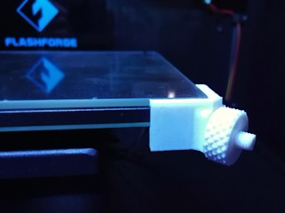
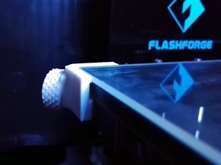
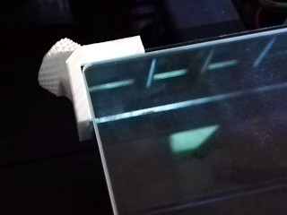
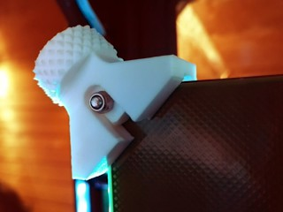
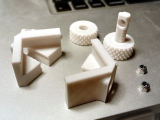
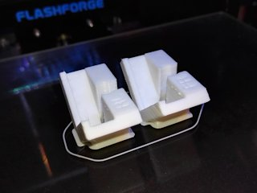
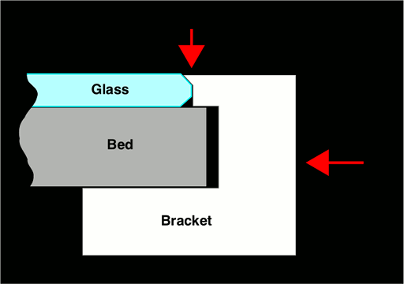
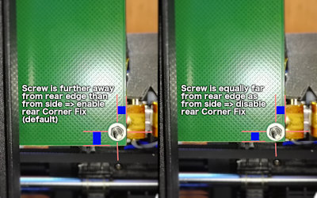
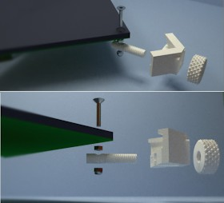

# Customizable Adjustable Glass Bed Bracket
*Customizable adjustable bracket for mounting glass plates on the print bed of 3D printers like the FlashForge Creator Pro (formerly thing:1949142)*

### License
[Creative Commons - Attribution - Share Alike](https://creativecommons.org/licenses/by-sa/4.0/)

### Attribution
This is a remix of multiple source models: the original ‘Flashforge Creator Pro Adjustable Glass Bed Bracket’ by chewbone ([Thingiverse thing:1291106](https://www.thingiverse.com/thing:1291106)), which was modified by omegatron ([Thingiverse thing:1296854](https://www.thingiverse.com/thing:1296854)), then by Lochemage ([Thingiverse thing:1940192](https://www.thingiverse.com/thing:1940192)), and then by me.

### Gallery

[🔎](images/bracket01.jpg) [🔎](images/bracket02.jpg) [🔎](images/bracket03.jpg) [🔎](images/bracket04.jpg) [🔎](images/bracket05.jpg) [🔎](images/bracket06.jpg)

*Yes, there's quite a bit of text here, but it's worth it to read all of it. Even if you're familiar with Customizer and printing strong heat-resistant parts, you should still read the ‘Mounting’ and ‘Using’ sections for some important hints.*

## Intro

This is yet another iteration of the adjustable glass bed bracket. This time, not only the bracket itself is adjustable, so is the model! This customizable bracket fits the FlashForge Creator Pro and printers with similar build plates with M3 bolts at their corners. The adjustable knob makes it easy to swap out glass plates if you have more than one, so you can start printing on another plate while the first one is still cooling down.

The main advantage of this design is that it allows to mount the glass plate without anything sticking out above it. This means you never need to worry about the risk of your nozzles crashing into the brackets. This particular remix improves upon the originals by not sandwiching the bracket between the bed and the pin. This makes it much easier to adjust the bracket, and it also offers a more balanced mount.

If you have yet to buy a glass plate, try to find one that is just a few millimeters smaller than the bed in both the X and Y directions, and has rounded or beveled edges. Such plates work best with these brackets. **Borosilicate glass** is highly preferred over regular glass. Avoid plates thicker than 4 mm: they will take long to heat, and because glass is a rather good thermal insulator, their surface temperature will be a lot lower than expected.

*Obvious disclaimer:* I am not responsible for any possible damage caused by the use of these brackets, not if you follow my advice, and certainly not if you ignore it.
 

## Creating a customized bracket

Do not just print the example STL file, it is unlikely to fit your setup. Instead, open the `.scad` file in [OpenSCAD](https://www.openscad.org/) and **[use the OpenSCAD Customizer](https://www.dr-lex.be/3d-printing/customizer.html)** to generate brackets that match your particular bed and glass dimensions. The Customizer is limited to plates roughly the same width and depth as the heated bed itself.

Measure the *width, depth and height* (in other words *X, Y* and *Z* dimensions) of both the glass plate(s) and the bed (without glass). Next, enter those values in the corresponding fields in Customizer. Be as accurate as possible! Aim for at least 0.5 mm accuracy, this is possible with a simple ruler and a keen eye.
If you have multiple supposedly “identical” plates, there will often be small differences between them: take the *minimum* width and depth across all plates.

You can opt to mount the brackets on the front right and rear left corners, or front left and rear right. One pair of brackets is sufficient, but should you want to clamp all corners anyway, just run Customizer twice for both configurations. The models are marked so you know where to mount them: *FR = front right, FL = front left, RL = rear left, RR = rear right.*

The default is to center the glass on the print bed, but if you want to align one of its edges to an edge of the bed, you can select that in the options. For instance, I have aligned mine to the front edge because my start G-code chops off oozed filament on that edge.

You can choose to add an extra pair of tiny *ridges* that may help to keep the plate clamped down, an explanation can be found below.

The option *‘Rear Corner Fix’* in the advanced settings compensates for an oddness of the FFCP (at least mine). This is also explained below. Don't forget to disable this if you are generating brackets for printers with a different bed design.

If your glass plate is larger than the bed, you may want to enable *‘allowTabInset’* in the advanced settings to allow the glass to extend somewhat into the edges of the bracket. This option is disabled by default because it could make the bracket weaker. If the glass extends much more in one direction than the other, the inset will only occur for one edge to ensure alignment. Avoid that situation, and again: avoid plates larger than the bed altogether.

If the generated 3D model shows **“FAIL,”** then either you've entered non-numerical dimensions, or your glass plate is unfortunately too large or small to be compatible with the brackets. You can try to fiddle with the advanced settings if the dimensions are borderline, but it is advisable to find some other glass instead, that has nearly the same size as the bed.

### When to use the ‘Extra ridges’ option

If your glass has beveled or rounded edges, it is worth it to enable the *‘Extra ridges’* option in Customizer. As the figure shows, the ridges can clamp down the glass by grabbing it on the bevel. This is not strictly necessary when using borosilicate glass, but regular glass or other materials that have a significant coefficient of expansion, are more likely to warp and lift at the edges when the bed is heated.

If you want to have the same clamp-from-above effect with glass that has straight edges, you can only do so by ignoring my advice of never letting anything stick out above the glass. If you make the brackets about 0.2 mm taller than the glass and enable the ridges, they will also clamp the glass from above. This is not worth the risk however: trying to clamp down the glass is *pointless* if you follow my usage instructions.

### When to enable/disable the ‘Rear Corner Fix’ option

[🔎](images/RearCornerFix.jpg)

The bed on my FFCP isn't perfectly symmetrical and by default, the models will be generated to compensate for this. Check the bottom side of your heated bed at the rear (hint: use a mirror or take a snapshot with your smartphone) and compare it to the photo. If it looks like in the left photo, you don't need to change anything to the defaults. If it looks like in the right photo, disable the ‘Rear Corner Fix’ in the advanced settings.
 

## Choosing What Parts to Print

Next to the customized bracket model you created above, you will also need to print one pin and one nut (knob) per bracket. These are the choices you need to make:

* **Print spring-loaded knobs or not?** If you're willing to spend a little extra time molding silicone gaskets or printing them with a flexible filament, it is well worth it to print the spring-loaded knobs from the *SpringLoadedKnobs* folder instead of the plain ones. The springs ensure that the glass remains clamped regardless of differing thermal expansion of the heated bed versus the glass plate.
* **Print pins and nuts with fine or coarse thread?** The coarse thread is easier to print but offers rougher adjustment. I recommend to try the fine thread first.
* **Print regular or small knobs?** You only need the smaller ones if you have a thin bed and the regular size knob would stick out above the glass. Otherwise the regular ones are easier to adjust.
* **Print regular or extra long pins?** The *XL* versions of the pins are slightly longer than the normal ones. Only print the longer ones if necessary, because printing them in ABS or PC will be even more difficult than the shorter ones. If these still are too short, you definitely need to find a glass plate that more closely matches the size of the heated bed.
* **Print hollow or solid pins?** In most cases you should print the hollow one, it is less likely to warp during printing. Only use the solid one if you have a good reason. (There is no hollow version of the coarseThread because its shape leaves no room for a hollow space.)
 

## Printing

*This must be printed in a material that can withstand the heat of the heated bed!*

The model that comes out of Customizer is ready to print _without supports_. The worst overhangs are 45°, which should be easy to print if you have tuned your printer well. A fan can help with the overhangs but if you print ABS, either reduce fan speed if you can, or print hot and slowly.

If the pins seem too thick to fit inside the knobs, you can try re-printing the knobs scaled to 102% or more in the XY plane. (Mind that this is a sign that your printer is not printing accurately and you would be better off fixing the root cause of that problem than doing workarounds like this.)

I printed the nuts and pins at 0.1 mm, the bracket at 0.2 mm. I printed extra slowly for additional strength. I used a brim on the corner pieces, but this was probably unnecessary. Print the pins at 100% infill. Infill for the other parts doesn't really matter, but I do recommend to print them with 3 perimeters for strength. To get the best detail on the threads of the pin, print slowly with the fan enabled if necessary. If you really have trouble printing the pins, you might try printing them upright, or use the ‘coarseThread’ versions instead.

The **material** choice is important. Most crucial are the pins, because they are pushed against the heated bed, hence must be the most heat-resistant. What material you need, depends on the maximum temperature to which you will heat the bed during everyday use.
From best to worst, here are some choices for the most common filaments:
* **Polycarbonate (PC):** this is an excellent material because it can withstand all reasonable heated bed temperatures, therefore if you print the brackets with it, you will never have to worry about the bed temperature. I would recommend it if you will often print ABS at bed temperatures near 110°C. Unfortunately PC is difficult to print with. The absolute minimum extruder temperature is [260°C](http://reprap.org/wiki/Polycarbonate#Heater_Settings). You need an all-metal hot-end to print at that temperature, because the teflon liners in standard hot-ends will quickly degrade at that temperature, releasing toxic fumes. You can of course order a PC print through a service like 3DHubs. If price is an issue, it is OK to have only the pins printed in PC, and print the brackets and knobs yourself in ABS.
* **ABS:** this is a good material because it will not easily deform below 110°C. If you will mostly print PLA and PETG, and only occasionally ABS, then ABS brackets are perfectly OK. You might need to print new pins from time to time because they may bend after a while. To minimize deformation, always follow the instructions from the *Mounting* and *Using* sections!
* **PETG:** this is good if you will never heat the bed above 75°C, e.g. if you'll only print PLA and occasionally PETG. Don't use it if you will ever have to do an ABS print though.
* **PLA:** I would not recommend this, unless you'll never heat the bed above 55°C. If you would ever need to heat the bed above 60°C, your PLA pins and brackets will deform or melt.

I have used ABS printed pins for about half a year, after this they were somewhat bent but still usable. I printed new pins in polycarbonate, and I expect those to last forever.

If you're the [AvE](https://www.youtube.com/user/arduinoversusevil) kind of guy and have the tools and skills for metalworking, an alternative to obtain perfectly heat-resistant pins, is to buy stainless steel M8 × 1.25 bolts and transform them into the shape of the pins, or create the shape from scratch. Stainless steel is ideal due to its low thermal conductivity, which reduces the need for heat-resistance of the other parts of the bracket.
 

## Mounting

This design differs from the originals it was remixed from, in that you do not need to unscrew any of the existing nuts or bolts (except possibly on newer printers, see below). Instead, you need an additional M3 nut per pin. I recommend to use *nyloc* nuts. Mount the pin with the recess upwards, covering the existing M3 nut, and tighten the pin with the extra M3 nut ([this tool](https://www.thingiverse.com/thing:1959962) may come in handy).

See the following rendered 3D image for an illustration of how the complete assembly fits together. Again, even though this image shows the screws separately, you do not need to remove them. This was only rendered as such to help people who are building their printer from scratch.

[🔎](images/bracket-mount.jpg)

*Important:* only tighten the M3 nut just to the point where the pin can no longer move vertically. Do not tighten it further, unless you printed the pin in polycarbonate or will never heat the bed anywhere near 110°C.

If you don't have any M3 nuts to spare, you can also print the pin from [omegatron's original model](http://www.thingiverse.com/thing:1296854) and mount it using the existing nut, with the recess downwards. I do recommend using my version of the pin if possible.

*Note:* the Creator Pro used to ship with bolts on the corners of the print bed that were about 20 mm long in total, making them stick out about 11 mm below the bed. It seems that recently FlashForge switched to shorter bolts, which makes it impossible to mount the pins as-is. If this is the case for your printer, you will need to replace the bolts with longer ones. Look for 20 mm M3 bolts with a flat head, preferably also with a hex socket.
 

## Using

If you use the *spring-loaded knobs,* read the instructions from their README, and skip the following paragraph because those knobs make it redundant.

Otherwise, the correct workflow is to first **preheat** your bed with the glass plate on top, and only tighten the knobs when the temperature is stable. The reason is that borosilicate glass has a much lower thermal expansion coefficient than the bed, therefore if you would tighten it cold and then heat, the bed will become larger w.r.t. the plate, and it may be loose enough to wiggle around. The whole point of these brackets is that it is very easy to adjust them, so it is better to adjust them when not really necessary, than *not* to adjust them when needed.

Do not tighten the knobs like crazy. Just tighten them up to the point where the glass cannot move. Over-tightening may cause the plastic to deform, or the plate to lift if you did not print the brackets with accurate dimensions.
 

### Should you remove the blue sheet or BuildTak when using a glass plate?

If you don't foresee that you will ever print on the sheet again, you should remove it. The sheet acts as an insulator and will cause a drop in temperature between the bed and glass, as much as 10°C depending on the temperature and thickness of the sheet. One small advantage of leaving the sheet installed, is that it provides some friction, making it less easy for the glass to slide around than on the bare metal surface. However, it should be the brackets that keep your glass in place, not the surface.

## How I Designed This

I took omegatron's model, cleaned it up in Blender, and chopped off all the parts that would vary when making it customizable. I exported it to STL, and converted this to an OpenSCAD polyhedron using stl2scad, because Customizer does not allow importing STL files. Then I added the necessary customizable shapes using the usual SCAD magic.

‘GlassBedNut-v3’ is the same shape as the original, although I cleaned up the STL a bit to avoid weird glitches in Slic3r.

## Updates

### 2016/12/11
I updated the pin model to be longer at the side of the bed. This should make it more resistant against deformation. If you print new pins, be sure to use this new model. Remember: do not tighten the pins any harder against the bed than necessary. Otherwise you'll end up with the counter-intuitive situation where the pin becomes the more loose, the more you tighten it.
Included *‘divided’* variation of the pin model (this had a cavity that might allow to print the threaded part with less infill, however this was unpractical so I removed it again).

### 2016/12/12
Allowed larger range of values in customizer: bed thickness can now go down to 5 mm and tabs can go up to 7 mm.

### 2016/12/27
Added smaller nuts and coarse-threaded variants (using the same threads as Lochemage's remix of the original brackets).

### 2017/05/09
Completely overhauled Customizer so it is much easier to use, and offers a wider range of parameters.
Created [Spring-loaded Knobs remix](http://www.thingiverse.com/thing:2313598), which I highly recommend over the plain knobs.

### 2017/05/14
Added ‘Rear Corner Fix’.
2017/06/04: Bumped default tabWidthOffset from 1.2 mm to 1.5 mm.

### 2017/06/18
Added a version of the regular pin with the threaded section hollowed-out. This makes it less likely to warp when printed in ABS or polycarbonate.
Fixed the broken preview in Customizer/OpenSCAD.
Minor update 2017/07/25: made error messages in customizer preview more readable.

### 2017/08/19
Added XL versions of the pins, these are about 6mm longer.
Wasted some of my precious time due to the stupid “Token Expired” bug in the Thingiverse site. If this kind of crap keeps happening, I'll just stop uploading models altogether.

### 2019/04/07
Added (advanced) option to change the length of the sides of the bracket.

## TAGS:
`Adjustable`, `customizable`, `customizer`, `FFCP`, `FFCPRo`, `glass`, `Glass_bed`, `Glass_bed_holder`, `openscad`, `supportless`
