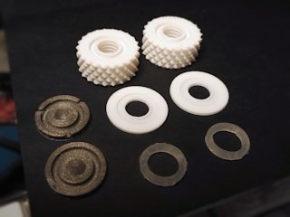
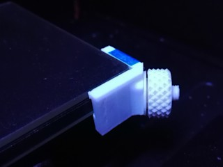
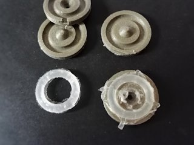
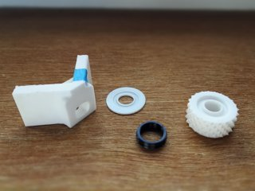

# Spring-loaded Knobs for Adjustable Glass Bed Bracket
*Knobs with built-in spring action for adjustable glass bed brackets (formerly thing:2313598)*

### License
[Creative Commons - Attribution - Share Alike](https://creativecommons.org/licenses/by-sa/4.0/)

### Attribution
See attribution info in the top-level README.

### Gallery
[🔎](images/springknobs1.jpg) [🔎](images/springknobs2.jpg) [🔎](images/springknobs3.jpg) [🔎](images/springknobs4.jpg)

## Description and Instructions

These are improved knobs for the Customizable Adjustable Glass Bed Bracket for the FlashForge Creator Pro and similar printers. These knobs have a **silicone gasket** incorporated in them, which acts as a spring. As an alternative, you can print the springs using a **flexible filament.**

The problem with the original knobs and many other bracket designs, is that the thermal expansion of the aluminium bed is much larger than that of the glass (especially borosilicate glass). This means if you tighten the knobs while the bed is cold and then heat it, it becomes larger than the glass. This causes the brackets to lose their grip, allowing the glass to shift around.

These spring-loaded knobs solve that problem by keeping on pushing against the brackets even if they move inwards a little due to the bed expanding. The gaskets are just thick enough to offer the required spring travel, without being too thick to make the brackets wobbly.

Some assembly and patience is required: you need to create your own silicone gaskets with a printable mold, or you can print them with a flexible filament. I provide molds for 3.5 mm and 4 mm tall gaskets. Which one is most suitable, will depend on how flexible the silicone compound is that you will be using. I suggest to simply print both molds, make two pairs of gaskets, and see which ones work best.
 

## Method 1: make gaskets using silicone compound

Carefully read the instructions on the [Customizable Gasket Mold Maker page](https://www.thingiverse.com/thing:2287689). In a very short nutshell: print the molds in **ABS,** as it seems to adhere the least to silicone compound. Use **RTV silicone** if you can.
If you want even thicker gaskets, you can make your own with Customizer on that page. The inner diameter must be *10 mm* and the outer diameter *14.1 mm.* You could also try a gasket with a square profile to increase stiffness.

The nice thing is that you can already use the knobs without the gaskets while you're waiting for them to cure. You only need to remember to manually re-tighten the knobs after preheating the bed. Once you have the gaskets, unscrew the knobs, drop in the gaskets, and you're good to go.

### Preparing the gaskets for use

Cut or pry off any excess silicone from the gaskets to make them nice and round. Make sure the gaskets are fully cured before assembling the knobs. RTV silicone gaskets should be ready to use, but for regular silicone, you should leave the gaskets in the open air for at least 24 more hours, probably longer for neutral cure compound. This allows them to cure further and release solvents still contained inside. Again, exposing them to humidity may speed up this process.
 

## Method 2: print gaskets/springs with flexible filament

If you have a sufficiently flexible filament, you can print an effective spring instead. The `Gasket-TPU-printable` STL file can be printed as-is in TPU. Infill doesn't matter because the model is a hollow shape. The filament must be elastic and reasonably heat-resistant. I have tried this in NinjaFlex which seems to work well. Anything much harder than Shore 85A is likely to be too stiff to act as a spring.
 

## How to use the knobs

Remove any remains of hairspray or glue stick from the bottom of the disks and brackets, to ensure these parts can easily slide against each other, otherwise tightening the knobs could be difficult. A wee bit of silicone grease/oil can help as well, you may need to re-apply this occasionally. Assemble and mount the knobs as shown in the photos.

You can adjust the knobs in two ways:
1. Preheat the bed to the highest temperature you'll use, and then tighten the knobs just beyond the point where the glass can no longer move.
2. Just tighten the knobs with the bed cold, to the point where there is only a tiny gap left between the disk and the knob.

Either method is OK, but the first one is preferred because it minimizes the amount of stress on the brackets and could prolong their lifespan. If you're not going to print for a while, it is advisable to loosen one of the knobs.

If you made the gaskets with regular silicone compound, they will be quite soft when freshly made, and become harder over the course of the next weeks. This means you may need to tighten the knobs more with freshly made gaskets.
 

## Printing

For the **knobs:** as with the originals, **ABS** is recommended for heat resistance. Print slowly and if possible, provide moderate cooling to get an accurate result. See the main README in the top level of this repository for more details.

All these parts should be printed at 0.1 mm layers. Infill doesn't really matter.

The knobs are available in both fine and coarse threads, and normal and small sizes, like the originals. Print the knob that matches the pin thread and bracket height you're using. You should print the normal size knobs unless you have a very thin bed that would cause the knobs to stick out above the glass.

For the **gasket mold:** again see the [Customizable Gasket Mold Maker page](https://www.thingiverse.com/thing:2287689) for instructions. In a very short nutshell: use **ABS** because it seems the least sticky to the silicone.
To avoid that the tip of the alignment cone becomes a molten blob due to short layer print times, you can try to:
* print two molds at once. You'll need two gaskets anyway, and making them at once will save you a lot of waiting time. It isn't worth it to try saving a few grams of filament by only printing one mold!
* print the molds together with something else to increase the time between layers.
* provide all the cooling you can muster while the cone is being printed.

For the **printable gasket/spring:** just print it in a sufficiently flexible/elastic filament, like NinjaFlex or similar. When in doubt, set infill to 100% although this shouldn't matter because the model is hollow.
 

## Background Information

The reason why I chose silicone gaskets as springs, is that silicone does not easily lose its shape over time, it is quite heat-resistant, and most importantly, everyone can easily make their own gaskets with a 3D printed mold! Any other 3D printed glass bed bracket that relies on springiness of the shape itself, is pretty much doomed to deform over time, especially when heated near 110°C. These knobs on the other hand should last a long time.

## Updates

### 2020/03/07
Added printable spring/gasket that should work well in a soft TPU like NinjaFlex.

## TAGS

`Adjustable`, `FFCP`, `FFCPRo`, `glass`, `Glass_bed`, `Glass_bed_holder`, `knob`, `nut`, `silicone_mold`, `spring_loaded`
